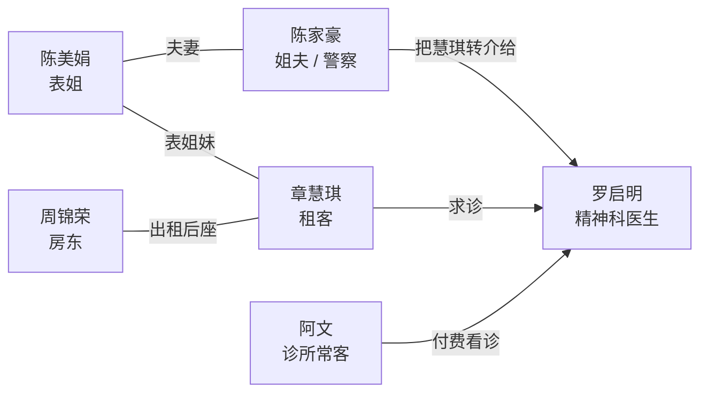
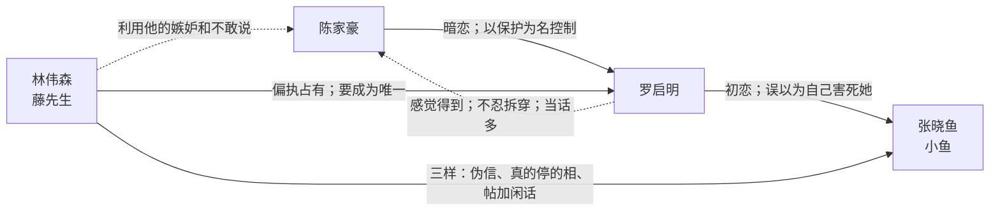
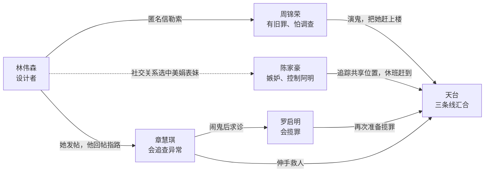

# 暗度 · 人物关系与故事

正片时间：2014 年 8 月。详细人设见 [人物志](05-人物志.md)。本文把关系拆成三张图：表面关系、隐藏关系、阴谋关系。

## 先记住六个人

| 人物 | 身份 | 与主线的关系 |
| --- | --- | --- |
| 章慧琪 | 租客；第一章 POV | 租下周锦荣的后座，经表姐转介认识罗启明 |
| 罗启明 | 精神科医生；第三章 POV | 双性恋，初恋是小鱼；为章慧琪看诊；一直误以为小鱼的死是自己的责任 |
| 陈家豪 | 罗启明的大学旧友，深水埗警区刑事调查队督察；第二章 POV | 陈美娟的丈夫；暗恋罗启明但不承认，只暗中帮助，以“保护”为名监视 |
| 林伟森 | 罗启明旧同学、诊所常客「阿文」、网上「藤先生」；第四章 POV | 偏执地想独占罗启明；贯穿罗的人生但不被关注；全局的设计者 |
| 周锦荣 | 章慧琪的房东 | 曾害死妻儿骗保；受林伟森勒索后开始演鬼赶客 |
| 陈美娟 | 章慧琪的表姐、陈家豪的妻子 | 因担心慧琪，请家豪把她介绍给罗启明 |

丽芬、阿轩、小鱼都已死亡，但作用不同：

- **丽芬、阿轩**：周锦荣的妻儿。周利用他们的遗物演鬼。
- **小鱼**：罗启明的初恋。屯门、街市、护理学院。走廊、鱼牌、节拍器、大学站。鱼牌是父亲档口的定情信物。节拍器是后来给的呼吸工具。她要被看成人，不要被看成下一台。她是罗启明看见的长发女人，不是丽芬。同房和家里不进正片。

---

## 1. 2014 年表面关系

这一层是第一章就能理解的关系。

表面故事只有一条：

> 慧琪租到周生的平房，住了半个月后遇上“闹鬼”；美娟请丈夫家豪介绍大学旧友阿明为她看诊。家豪是差人，不是阿明的医院同事。

---

## 2. 隐藏关系

这一层按第二至四章逐步揭开。

最容易混淆的三点：

1. **陈家豪暗恋罗启明，罗感觉得到，不忍拆穿。** 自己没有对等情愫。躲开，当话多。两个人偶尔对上，立刻当冇发生。不互表，不上床。林伟森也暗恋罗，罗并不关注林同学。双性恋是真的。中学对同班男生有过一瞬，转瞬即逝。初恋是小鱼。回流后精神差时有过一夜，没有名字，不是陈。玩家在三章即时通里看见 2002 那几行，在二章琐事里看见对视后改口。
2. **陈家豪不是林的同谋。** 林只利用他的嫉妒、监视和不敢说；转介走「慧琪→美娟→家豪→阿明」自然链路。陈有妻子，爱只能做成帮助。
3. **小鱼是罗的初恋，不是情敌公式。** 林 2002 冬以藤先生介入，听完不拆，2004 年 11 月用三样下手：伪信、真的停的相、校园网帖加门底塞进来的打印页。评语不是他写的。她来不及想清楚，也来不及跟阿明说开。陈在确定前把三个字咽在洗衣房；阿明从来没听见。罗把怕倒给藤先生，不知道听的人是林同学。

---

## 3. 2014 年阴谋关系

林伟森不亲自动手。他把三个人已有的弱点接在一起。

林的目标不是杀死慧琪，而是让罗启明在天台再次说出：

> “是我害的。”

只要阿明再次揽罪，林的“课”就成功。真结局里，慧琪还站着，阿明把这句话改成：

> “有人要我相信是我害的。”

---

## 4. 故事六步

细日表与因果链见 [时间线与因果](../设定/07-时间线与因果.md)。本层只记主线骨架，不是日表：

1. **2000–05｜旧案** — 罗、林医科五年。陈 2001–04 社会学。小鱼成为初恋；林以藤先生听秘密，2004 年 11 月用三样逼她；她来不及说开。她死，阿明揽锅、封换毁掉（练习簿电话、值班室虚焦相）；2005 夏毕业，陈送机，阿明外地。陈入警。旧号空号五年。林不对陈下手：陈是钉子。  
2. **2012｜周的旧罪** — 山泥倾泻骗保。  
3. **2013｜林开始布置** — 病人「阿文」+ 网上「藤先生」+ 筛中周。阿明问见过吗，林第三秒躲开。  
4. **2014.06–08.14｜导火索，再让她住稳** — 阿明按临床写建议中止（倾斜：看病倒转，再约治不成失眠，转介）；林诊室里笑，「下次我仍来」，不接转介。建议中止落了纸，赖着才碰得上后来的章。周真租；她发帖；藤先生回帖；半个月后才寄信。  
5. **2014.08.15 起｜三只手** — 周演鬼；陈转介并控制；林推两边。  
6. **2014.08.21｜天台** — 慧琪伸手；陈重伤生还停职；课被打断。

---

## 5. 三层鬼

哪一章可以钉死见 [时间线](../设定/07-时间线与因果.md) §5。此处只管「是什么」：

| 层 | 慧琪 / 阿明看见什么 | 真相 |
| --- | --- | --- |
| 第一层 | 丽芬的声音、阿轩的玩具和脚印 | 周锦荣在演鬼 |
| 第二层 | 罗启明看见长发女人 | 那是小鱼。吓过了，会把活着的女人加成她。不是灵媒。 |
| 第三层 | 所有人像被推向同一个结局 | 林伟森设计了这场相遇 |

一句话总括：

> 周负责演鬼，阿明负责看见鬼，林负责把他们安排在同一场戏里。

---

## 次要人物

- **阿乐**：慧琪前度。怕她再次“见到”，选择离开；不是反派。
- **杰仔**：只在真结局片尾出现，不参与正片人物关系。

为保持清楚，这两人不放进主关系图。
