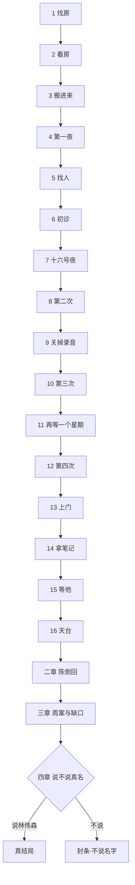

# 暗度 · 对话分支

对稿真相源：**选项类型、Flag、汇合、锁结局**。台词与当场选项文案仍以各章剧本为准；时间见 [时间线与因果](../设定/07-时间线与因果.md)。

## 读法

| 标记 | 意思 |
| --- | --- |
| **主路** | 推荐／默认推进 |
| **旁支** | 改变笔记、温度或时机，不改结局骨架 |
| **汇合** | 无论选哪条，下一场相同 |
| **锁结局** | 影响真结局／封条（不说那个名字）／温度，不能当纯旁白 |
| **样板** | `游戏/assets/` 已实现（第一章十六关全通） |
| **必做** | 关卡清单上的「要做」，做完才能往下 |
| **未做** | 只在剧本里 |

规则：一～三章选项**没有对错**，只有权限和温度。四章真名才锁结局。一章窗口：电话（含陈那句地址）、倾偈、站内留言、讨论区、墙簿、日记簿。汇出档三章才开。日记簿不在墙簿。

关于章自己的事（电表、没回的短讯、阿乐的汤、表姐叫她去瞓、她想再见医生、报过警）只置 flag 或弹一句提示（`tip`，几秒后消失），**不写笔记、不进日记簿**。日记簿里的「记下」主语都是别人：周问脚湿、周知道星期六、医生没这样讲。

## Flag 总表（实装用）

| Flag | 何时置位 | 谁读 | 效果 |
| --- | --- | --- | --- |
| `sawLinAd` | 1-1 点墙簿「藤先生」 | 四章工作台 | 噪音齐全；未点也可通关 |
| `sawOwnPost` | 1-1 点开讨论区「阿琪V」帖 | 四章工作台 | 回帖连结对上；未点也可通关 |
| `serial1` | 第 7 关 讨论区第一帖 | 桌面廿八屋 | 自己按发布。藤不回写在帖里；可不开也继续 |
| `serial2` | 第 9 关 第二帖 | 桌面廿八屋 | 自己按发布。藤只一句写在帖里；可不开也继续 |
| `serial3` | 第 11 关 第三帖 | 桌面廿八屋 | 自己按发布。藤又不在写在帖里；可不开也继续 |
| `clinicAddr` | 08-15 陈把诊所地址发到手机 | 夜里这部手机 | 可再打开那一条 |
| `askedOld` | 1-1 发过站内讯息 | 收件箱 | 当晚不在线。次日早回信在站内留言，不先念出来 |
| `sawMail` | 点开周的回信 | 收件箱 | 看过才能赴约 |
| `askedMudslide` | 1-2 A 追问泥石流 | 1-5 录音 | 夜里女人叫仔多一声 |
| `debtSlip` | 1-2 C 口误 | 三章 | 噪音「还债→还生活」 |
| `photoSill` | 1-5 拍照脚印并记下来 | 日记簿里的照片 | 物证温度 |
| `called999` | 1-5 报警 | 二章陈审计 | 与越权查询对上 |
| `meiNoise` | 1-6「家豪怪怪地」 | 二章 | 「像亲兄弟」噪音 |
| `askedWorry` | 1-6 B 追问不太好 | 二章标签 | 保护／拆的对照 |
| `askedWhyFast` | 1-6 C 为何塞给他 | 二章 | 改口／监视回收 |
| `clinicAvoid` | 第 12 关 按亮的「问他」 | 笔记 | 「医生也在回避」；前三次按钮灰 |
| `showedDirt` | 第 14 关 黑料给阿明 | 第 15 关／天台温度／结算卡 | 他问「要我走吗」 |
| `keptMing` | 第 15 关 留（推荐） | 第 16 关 | 他在场；伸手更顺 |
| `gaveRoofKey` | 第 15 关 钥匙给周 | 第 16 关 | 门垫下再出现 |
| `ranUp` / `calledName` / `grabbed` | 第 16 关 三个动作 | 清单 | 一章过关 |
| `chenProtectLabel` | 2-2 记成保护 | 2-7 | 标签裂开更痛 |
| `chenAdmitDirty` | 2-2／2-5 认脏 | 2-7 | 「我不是为你」更硬 |
| `keyInHand` | 2-6 握紧钥匙 | 1-12 重看 | 撞门像闯入 |
| `controlIsAll` | 3-3 全部答案 | 3-6／四章 | 封条温度+ |
| `touchSleeve` | 3-4 碰袖口 | 笔记 | 体温分人鬼 |
| `saidTrueName` | 4-6 A | 结局 | 真结局 |
| `saidPartialName` | 4-6 C | 结局 | 偏封条 |
| `sealStay` | 4-7 留下／搬离 | 片尾前 | 都成立 |

未列 Flag 的选项只改当场口气，不进存档。

---

## 第一章 · 章慧琪

按 [第一章关卡](01-第一章-关卡.md) 分十六关。每关一张清单，「要做」打满勾才能往下。下面每关先列选项（类型、后果），再列实装节点（`游戏/assets/` 里的函数名）。

**一章成功硬门槛**：可错过墙簿广告和自己的旧帖；不可错过第 13 关「不是同一只」（`notsame`）和第 16 关「抓住他的手腕」（`grabbed`）。

### 一 · 住进来

#### 第 1 关 · 找房（07-31 夜）

| 选项 | 类型 | 后果 |
| --- | --- | --- |
| 发求助帖 | 必做 | `postedHelp` |
| 删掉「元朗 天水围」自己搜 | 可做 | `ownSearch`；搜索或点地区都算；不挡路 |
| 预约睇楼 | 主路 | 打开过荣汇街盘页（`S.known.rong`，自己搜或从藤的连结都算）就去得 → 第 2 关 |
| 收藏 | 旁支 | 每个盘页都有；右上角「收藏」列出收过的盘（`S.favs`） |
| 发站内讯息 | 旁支 | 玩家自写正文；次日早回信；仍可预约。`askedOld` / `sawMail` |
| 返回搜寻 | 旁支 | 大角咀／荃湾及其他区零星盘都走不通；卡住哪条，「四条」上划哪条 |
| 点墙簿「藤先生」 | 旁支 | 噪音笔记 `sawLinAd`；可跳过 |
| 点讨论区自己的帖 | 旁支 | 见藤先生 07-29 回帖及荣汇街连结 `sawOwnPost`；可跳过 |

节点：`web.js` 廿八屋 → `goViewing()`（`levelReady()` 才放行）→ `finishLevel(1)`。

#### 第 2 关 · 看房（08-01 15:20）

| 选项 | 类型 | 后果 |
| --- | --- | --- |
| A 从相片追问西贡／山泥 | 旁支 | 周才含糊答天灾；未主动讲家人名；夜里多一声叫仔 `askedMudslide` |
| B 先看房间 | 旁支 | 见窗台水印被脚遮（场面，不是周说的） |
| C 一个人住会怕吗 | 旁支 | 口误「还债→还生活」 `debtSlip` |
| 「这把？」／「怎么知道住惯」 | 旁支 | 天台钥匙；「睇得细」噪音 |

节点：`startViewing()` → `HUBS.view`（厅、走廊、主房；动作「问周生」`askZhouView`）→ 往下 `payDeposit()` → `afterTour()` → `finishLevel(2)`。

#### 第 3 关 · 搬进来（08-01 夜～08-13）

| 交互 | 类型 | 后果 |
| --- | --- | --- |
| 点屋内物件，记「本来的样子」 | 必做 ≥4 | `baseSheet()` 写进 `S.base`（车、水龙头、储物室门、窗台、全家福） |
| 「先睡一晚」 | 主路 | 记满四样才亮 → 两周日历 |
| 日历 08-13「只有水」 | 必做 | `rec-water`，第 9 关对照纸要用 |
| 日历其余几天、08-08 倾偈 | 旁支 | 可选笔记 |

节点：`moveInStart()` → `drawMoveIn` → `twoWeeks()`（cal 模式）→ 往下 `finishLevel(3)`。前两周车不会自己走。

### 二 · 夜里

#### 第 4 关 · 第一夜（08-14 傍晚～08-15 凌晨）

| 选项 | 类型 | 后果 |
| --- | --- | --- |
| A 发生什么事 | 旁支 | 笔记：忽然收回／重建未定 |
| B 我可以晚一点走 | 旁支 | 他已后悔说出口 |
| C 不追关门 | 旁支 | 无额外笔记 |
| 夜里热点 | 必做 | `markTonight()` 写进 `S.tonight` |
| 摆在一起 | 必做 3 组 | `openPairs()`；今晚一张对本来一格，对不上不扣分 |
| 脚印：擦掉／拍照／不理 | 旁支 | 擦掉会再出现；拍照后记下来才留得住 `photoSill` |
| 甲 报警 999 | 旁支 | 不派车；只留 flag，不进日记簿 `called999` |
| 乙 敲周门 | 旁支 | 「水管」谎；问脚湿不湿 → `note-dry`。不敲则第 5 关门口补这一问 |
| 丙 忍到天亮 | 旁支 | 录音听三遍 |
| 打阿乐 | 旁支 | 响两声挂断 |

节点：`startChange()` → `nightScene` → 摆齐三组才出岔路 → `leaveNightToMei()` → `finishLevel(4)`。一章不许读信。

#### 第 5 关 · 找人（08-15 早～08-16 午）

| 选项 | 类型 | 后果 |
| --- | --- | --- |
| 我不是病人 | 旁支 | 仍转介 |
| ……问下得 | 主路 | 仍转介 |
| 家豪自己都怪怪地 | 旁支 | 美娟：「像亲兄弟」噪音 `meiNoise` |
| 陈来电 A 好。明天我去。 | 主路 | 名片：澄心，明日 16:00 `clinicAddr` |
| 陈来电 B 追问不太好 | 旁支 | 笔记：接不上昨日 `askedWorry` |
| 陈来电 C 为什么这么快塞给他 | 旁支 | 改口太快 `askedWhyFast` |
| 出门前拍车、拍水龙头 | 必做 | `photo-car-out`、`photo-tap-out`，第 7 关回家比 |

节点：`enterHub("dawn")`（前座门口 `passFrontDoor`、后座：倾偈 `startChat` → `leaveChat()` 回场景、短讯、两张照片）→ `howardCall()` `howardCalled` → 往下 `finishLevel(5)`。三条都接到「别查房东」+ 08-16 16:00。

#### 第 6 关 · 初诊（08-16 16:00）

| 选项 | 类型 | 后果 |
| --- | --- | --- |
| 候诊：执照／抽屉／电脑 | 旁支 | 抽屉里节拍器旁有鱼牌；电脑显示阿文**每周六** |
| 拿给他看 | 必做 | `handOver(6)`，日记簿里任一样都得，他各有一句 |
| A 我相信有鬼 | 旁支 | 「信号不是判决」 |
| B 我疯了 | 旁支 | 「疯这个字太懒」 |
| C 要人不把我当疯子 | 主路温度 | 不下诊断 |
| 初诊就要他上门 | 旁支 | 他拒绝。病人屋企唔系门诊 |
| 「问他」 | 灰 | 姐夫那句咽住。按钮灰着，不可点 |
| 作业卡 | 必拿 | `giveHomework(6)`；第 7 关清单就是它 |

节点：`goClinic()` → `clinicArrival(1)` → `enterClinic(1)`（`drawClinic` 诊室场景）→ `clinicSpeak` → `clinicTalk` → `leaveClinic()` → `finishLevel(6)`。

#### 第 7 关 · 十六号夜（08-16 夜～08-20 夜）

| 交互 | 类型 | 后果 |
| --- | --- | --- |
| 回家跟出门照片比 | 必做 | `paper-16` |
| 两分钟试两次（看住／去厕所） | 必做 | `tryWatch` / `tryBath` → `paper-20` |
| 美娟来电 | 主路 | `meiPhone1`：问食药、下星期六 |
| 发第一帖 | 旁支 | `postFromHub("wk1")` → `serial1` |
| 周在楼梯口 | 旁支 | 不必敲门。不问鞋 |

节点：`homeAfterClinic()` → `HUBS.home16`（厅、厕所、门口）→ 往下 `finishLevel(7)`。

### 三 · 星期六

#### 第 8 关 · 第二次（08-23 16:00）

| 选项 | 类型 | 后果 |
| --- | --- | --- |
| 拿给他看 | 必做 | `handOver(8)`：要交十六号晚、离开两分钟两张纸 |
| 分两堆 | 必做 | `sortPiles()`「纸上写住的／我心里信的」；放错只听到「呢句纸上有写？」 |
| 诊所听录音 | 主路 | 当人声。她坚持没问题。他停笔。有一夜不要开录音 |
| 论坛「靠星期六」 | 旁支 | 她坦白写了、他不看网 |
| 「问他」 | 灰 | 第二次咽住 |
| 作业卡 | 必拿 | `giveHomework(8)` |

节点：`clinic2()` → `clinicDoorChen()` → `finishLevel(8)`。

#### 第 9 关 · 关掉录音（08-23 夜～08-27）

| 交互 | 类型 | 后果 |
| --- | --- | --- |
| 自己按掉录音 | 必做 | `recorderPanel()`：先按掉，「去洗脸」才亮 → `nightNoRec` → `paper-norec` |
| 美娟家吃饭 | 必做 | `sundayMeal`：家豪误传精神不好 → `note-notsaid` |
| 表姐来电听到水声 | 必做 | `meiWaterCall` → `note-meiwater` |
| 对照纸 | 必做 | `openCompare()`：至少四行，一行是干鞋 → `paper-30` |
| 发第二帖 | 旁支 | `serial2` |

节点：`HUBS.norec`（后座、美娟家；动作「对照纸」）→ 往下 `finishLevel(9)`。

#### 第 10 关 · 第三次（08-30 16:00）

| 选项 | 类型 | 后果 |
| --- | --- | --- |
| 拿给他看 | 必做 | `handOver(10)`：交对照纸 |
| 吵 | 必做 | `fought3`；他要医她。她崩了。干鞋读两次 |
| 钟意你 | 主路温度 | 说出口；他不接；第四次回调「你当冇听见」 |
| 「问他」 | 灰 | 第三次咽住 |
| 作业卡 | 必拿 | `giveHomework(10)`；不约上门，要下星期六再带纸 |

节点：`clinic3()` → `clinic3Break` → `finishLevel(10)`。

#### 第 11 关 · 再等一个星期（08-31～09-05）

| 交互 | 类型 | 后果 |
| --- | --- | --- |
| 打给他 | 必做 | `callMingOffHours`：他先问纸，叫她别再打 |
| 一周日历 | 必做 | `openWeekCal()` 每天一行 → `paper-06` |
| 周在楼梯口 | 主路 | `nightBeforeTueZhou`：「又有人来，要煮糖水」→ `note-zhoutue` |
| 表姐来电 | 旁支 | `meiTue`：只一句，她信约 |
| 发第三帖 | 旁支 | 帖不写喜欢 `serial3` |

节点：`HUBS.week`（后座、楼梯口）→ 往下 `finishLevel(11)`。

#### 第 12 关 · 第四次（09-06 16:00）

| 选项 | 类型 | 后果 |
| --- | --- | --- |
| 前台：阿文刚走 | 必做 | `S.visitSeen[4]` |
| 抽屉：鱼牌不见了 | 必做 | `S.clinicLooked.drawer4` |
| 偷看预约表 | 旁支 | `S.clinicLooked.sched` |
| **问他** | 必做 | 按钮第一次亮。问精神不太好；他回避、手抖 `clinicAvoid` |
| 拿给他看 | 必做 | `handOver(12)`：交补充纸 |
| 观察界 | 主路 | 督导、知情同意、公开新闻。09-06 夜上门 |

节点：`clinic4()` → `clinicArrival(4)` → `enterClinic(4)` → `clinic4Talk()` → `finishLevel(12)`。

「问他」灰三次再亮，就是剧本里「咽住三次」。

### 四 · 上门

#### 第 13 关 · 上门（09-06 21:40）

你带路。只能带他去你记下过的东西；每处先出「你看／他看」两行。

| 选项 | 类型 | 后果 |
| --- | --- | --- |
| 走廊尽头 A 我看见小孩脚印 | 旁支 | 「唔係同一只」 |
| 走廊尽头 B 那是丽芬 | 旁支 | 阿明否认，再落到「唔係同一只」 |
| 走廊尽头 C 不说话去走廊 | 旁支 | 他望门顶、你望门底，再落到「唔係同一只」 |
| 水龙头 | 必做 | 延迟三秒 `delay` |
| 全家福／玩具车 | 旁支 | 本来的样子记过才带得去 |
| 门口周递毛巾 | 旁支 | 问山泥年份 `S.visit.towel` |
| 送他走 → 贴储物室门 | 必做 | 周在打电话 `phone-you` |

**硬条件**：三个回答都落到 `notsame`。

节点：`visitHome()` → `HUBS.visit`（厅、走廊、厨房、门口）：`leadCorridor` / `leadTap` / `leadFamily` / `leadCar`（都先过 `gaze()`）、`visitTowel`、`visitFarewell` → `afterVisitListen()` → 往下 `finishLevel(13)`。

#### 第 14 关 · 拿笔记（09-07 16:10）

| 选项 | 类型 | 后果 |
| --- | --- | --- |
| 他去倒水，看工作台 | 必做 | 行程被删、本子不见 `stolen` |
| 走廊 陈 A 你动过他的东西 | 旁支 | 陈否认太快；钥匙声 |
| 走廊 陈 B 你要我离开他 | 旁支 | 「边个都好」「我见过」 |
| 走廊 陈 C 不争走 | 旁支 | — |
| 邮件两个附件都看 | 必做 | 新闻扫描、偷拍 → `mail-dirt`、`dirt` |
| 给他看 | 旁支 | `showedDirt`；他手抖，「松开都得」 |
| 先不给 | 旁支 | `hidDirt`；天台前仍可在第 15 关见他反应 |

节点：`missAppt()` → `HUBS.miss`（诊室、走廊）：`missDesk` → `missChen` → `missMail` → `missAttach(1/2)` → `missMailKeep` → 动作「给他看」`missShow` → 往下 `finishLevel(14)`。

#### 第 15 关 · 等他（09-07 夜）

| 选项 | 类型 | 后果 |
| --- | --- | --- |
| 拨给阿明 | 必做 | `calledMing2`、`namecall` |
| 廿八屋新闻：西贡山泥、市建局荣汇街 | 旁支 | 两则都记下 → `twofiles` |
| 白天上天台看看 | 旁支 | `S.searchRoof` |
| 他来了，叫出「鱼」 | 必做 | `countbreath` |
| 给过黑料：留／你走 | 旁支 | `keptMing`；没给过黑料默认留 |
| 天台钥匙给周／不给 | 旁支 | `roofKeyAsked`；给了 `gaveRoofKey`，会在门垫下再出现 |

节点：`nightName()` → `callMing()` → `goSearch()`（search 模式，打过电话「往下」就亮）→ `mingReturn()` → `mingReturnRest()` → `roofApproach()` → `roofWait()` → `finishLevel(15)`。

#### 第 16 关 · 天台（09-08 00:41）

无战斗选项。三个动作，各一个按钮：

| 动作 | 类型 | 后果 |
| --- | --- | --- |
| 开门，跑上后楼梯 | 必做 | `ranUp`；他说过别跟，你还是跟 |
| 叫他的名字 | 必做 | `calledName`；选「冲过去」也会停住再叫 |
| 抓住他的手腕 | 必做 | `grabbed`；周拉臂同时 |

固定节拍：周拉臂 → 抓住手腕 → 陈撞入倒下 → 黑屏。「我不是为你」必出。一章不准揭陈生死（二章：生还）。

节点：`roofNight()` → `ending()`：结算卡列日记簿里全部东西、全章「看见了，没有留下」、那封信给没给他看；清存档；「回到廿八屋」= `newGame()`。

---

## 第二章 · 陈家豪（样板未做）

| 场 | 选项 | 类型 | 后果 |
| --- | --- | --- | --- |
| 2-1 | A 继续跑 | 主路 | 体力／风声 |
| 2-1 | B 先看档案包 | 旁支 | 提前开 2-3 一部分 |
| 2-1 | C 打美娟 | 旁支 | 未接通；删「阿明」备注 |
| 2-2 | 记成「保护她」 | 旁支 | 档案标签「保护」；结束时裂开更痛 |
| 2-2 | 记成「我在拆」 | 旁支 | 更早认脏；「我不是为你」更硬 |
| 2-5 | 删掉方案「风险」行 | 旁支 | 天台更理直气壮 |
| 2-5 | 留下承认 | 旁支 | 多看慧琪一眼；冲得更直 |
| 2-6 | 钥匙握紧／塞回 | 旁支 | 撞门像闯入 vs 更直 |

**汇合**：同一伤、同一停职、同一句「我不是为你」。美娟钉死：「救人不等于没有害人」。  
**禁止**：独白「我爱他」；认出林伟森正脸。

---

## 第三章 · 罗启明（样板未做）

| 场 | 选项 | 类型 | 后果 |
| --- | --- | --- | --- |
| 3-1 | 收／不收慧琪证据 | 旁支 | 影响 3-2 早晚，不挡结案 |
| 3-2 | 钉满四证才送警 | 主路机关 | 周拘捕；层1停 |
| 3-3 | 「他控制我」=全部答案 | 旁支 | 封条温度+；更不想开旧号 |
| 3-3 | =一部分（推荐） | 主路 | → 翻咨询名单 3-5 |
| 3-4 | 碰袖口／不碰 | 旁支 | 体温 vs 「传染」笔记 |
| 3-6 | 打开即时通汇出档 | 主路 | 停在「有人骗过我」；可滚到 2002「中学同班、一瞬、当时冇发生过」和 2003「怕把她当病人」，不要一次倒完；「藤先生」+「阿文」+ Lam Wai-sum 不自动合成中文全名 |

**汇合**：周进去；女鬼还在；真名未说出口。

---

## 第四章 · 林伟森（样板未做）· 锁结局

### 4-1～4-5 复盘

| 场 | 选项 | 类型 | 后果 |
| --- | --- | --- | --- |
| 4-1 | 今晚塞信／再改一版 | 旁支 | 信必到；改版只更「自愿」 |
| 4-5 | 桌面物件对噪音 | 主路机关 | 与前三章笔记对上；不可逆 |

### 4-6 终局（操作权切回章慧琪）

| 选项 | 类型 | 后果 |
| --- | --- | --- |
| A 说出「林伟森」 | **锁·真结局** | 改口；慧琪还站着；诊室按不住他，开除并通缉；→ 4-8 片尾 |
| B 不说／翻过纸 | **锁·封条** | → 4-7；不说那个名字；他还在等下一次 |
| C 「常客。出来。」不给全名 | **锁·偏封条** | 林走；改口不完整；主线不推荐 |

真结局条件：打完一～三章；说真名；笔记噪音建议 ≥5（不足可说，改口多一轮追问）。

### 4-7 封条（不说那个名字）

| 选项 | 类型 | 后果 |
| --- | --- | --- |
| 留下／搬离 | 旁支 | 都成立；女鬼仍是小鱼；阿文仍被叫号 |

明线周案不回滚。

---

## 跨章：选项改什么／不改什么

| 改 | 不改 |
| --- | --- |
| 笔记噪音是否齐全 | 荣汇街必须住进 |
| 一章对周／阿明的温度 | 09-08 天台必发生 |
| 二章陈认不认脏的语气 | 陈重伤生还、停职 |
| 三章是否早开名单 | 周可结案；小鱼不散 |
| 四章真名／封条 | 林可不沾血。人不在房里。开除并通缉。两条命定不了 |

---

## 样板对账（`游戏/assets/`）

| 剧本场 | 样板 | 备注 |
| --- | --- | --- |
| 第一章 1～16 关 | 已做 | 搜房→天台→结算卡；`?level=N` 跳关 |
| 第 4 关 脚印三选 | 已做 | 擦掉／拍照／不理 |
| 第 1 关 站内讯息 | 已做 | 玩家自写；不预置问句 |
| 第 4 关 夜里 | 已做 | 按钟走，点热点不加速 |
| 二～四章 | 未做 | |

工程入口只有 [`游戏/`](../../游戏/README.md)。勿再维护重复的「第一章样板」子目录。

---

## 对稿检查清单

- [ ] 每个【选项】都写了后果（笔记／温度／汇合／锁）
- [ ] 旁支不偷偷改主时间线日期
- [ ] 一章无「破案选项」
- [ ] 二章无「我爱他」独白
- [ ] 三章不自动合成林伟森
- [ ] 四章真名由玩家点，不靠蒙太奇
