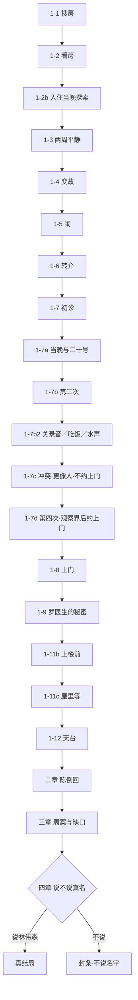

# 暗度 · 对话分支

对稿真相源：**选项类型、Flag、汇合、锁结局**。台词与当场选项文案仍以各章剧本为准；时间见 [时间线与因果](../设定/07-时间线与因果.md)。

## 读法

| 标记 | 意思 |
| --- | --- |
| **主路** | 推荐／默认推进 |
| **旁支** | 改变笔记、温度或时机，不改结局骨架 |
| **汇合** | 无论选哪条，下一场相同 |
| **锁结局** | 影响真结局／封条（不说那个名字）／温度，不能当纯旁白 |
| **样板** | `游戏/assets/story-*.js` 已实现（目前到 1-12 天台） |
| **未做** | 只在剧本里 |

规则：一～三章选项**没有对错**，只有权限和温度。四章真名才锁结局。一章窗口：电话（含陈那句地址）、倾偈、站内留言、讨论区、墙簿、日记簿。汇出档三章才开。日记簿不在墙簿。

## Flag 总表（实装用）

| Flag | 何时置位 | 谁读 | 效果 |
| --- | --- | --- | --- |
| `sawLinAd` | 1-1 点墙簿「藤先生」 | 四章工作台 | 噪音齐全；未点也可通关 |
| `sawOwnPost` | 1-1 点开讨论区「阿琪V」帖 | 四章工作台 | 回帖连结对上；未点也可通关 |
| `serial1` | 08-17 讨论区第一帖 | 桌面廿八屋 | 自己按发布。藤不回写在帖里；可不开也继续 |
| `serial2` | 08-24 第二帖 | 桌面廿八屋 | 自己按发布。藤只一句写在帖里；可不开也继续 |
| `serial3` | 08-31 第三帖 | 桌面廿八屋 | 自己按发布。藤又不在写在帖里；可不开也继续 |
| `clinicAddr` | 08-15 陈把诊所地址发到手机 | 夜里这部手机 | 可再打开那一条 |
| `askedOld` | 1-1 发过站内讯息 | 收件箱 | 当晚不在线。次日早回信在站内留言，不先念出来 |
| `sawMail` | 点开周的回信 | 收件箱 | 看过才能赴约 |
| `askedMudslide` | 1-2 A 追问泥石流 | 1-5 录音 | 夜里女人叫仔多一声 |
| `debtSlip` | 1-2 C 口误 | 三章 | 噪音「还债→还生活」 |
| `photoSill` | 1-5 拍照脚印并记下来 | 日记簿里的照片 | 物证温度 |
| `called999` | 1-5 报警 | 二章陈审计 | 与越权查询对上 |
| `meiNoise` | 1-6「家豪怪怪地」 | 二章 | 「像亲兄弟」噪音 |
| `askedWorry` | 1-6 B 追问不太好 | 二章标签 | 保护／拆的对照 |
| `askedWhyFast` | 1-6 C 为何塞给他 | 二章 | 改口／监视回收 |
| `clinicAvoid` | 1-7d 第四次才问精神不太好 | 笔记 | 「医生也在回避」；前三次只咽住 |
| `showedDirt` | 1-9 黑料给阿明 | 1-11／天台温度 | 他问「要我走吗」 |
| `keptMing` | 1-11 留（推荐） | 1-12 | 他在场；伸手更顺 |
| `gaveRoofKey` | 1-11 钥匙给周 | 1-12 | 门垫下再出现 |
| `chenProtectLabel` | 2-2 记成保护 | 2-7 | 标签裂开更痛 |
| `chenAdmitDirty` | 2-2／2-5 认脏 | 2-7 | 「我不是为你」更硬 |
| `keyInHand` | 2-6 握紧钥匙 | 1-12 重看 | 撞门像闯入 |
| `controlIsAll` | 3-3 全部答案 | 3-6／四章 | 封条温度+ |
| `touchSleeve` | 3-4 碰袖口 | 笔记 | 体温分人鬼 |
| `saidTrueName` | 4-6 A | 结局 | 真结局 |
| `saidPartialName` | 4-6 C | 结局 | 偏封条 |
| `sealStay` | 4-7 留下／搬离 | 片尾前 | 都成立 |

未列 Flag 的选项只改当场口气，不进存档。

---

## 第一章 · 章慧琪

### 1-1 租房网页

| 选项 | 类型 | 后果 | 样板 |
| --- | --- | --- | --- |
| A 预约睇楼 | 主路 | → 1-2 | 有 |
| B 发站内讯息 | 旁支 | 玩家自写正文；次日早回信；仍可预约 | 有 |
| C 返回搜寻 | 旁支 | 大角咀／荃湾及其他区零星盘都走不通；必须回荣汇街 | 有 |
| 点墙簿「藤先生」 | 旁支 | 噪音笔记；可跳过 | 有 |
| 不点墙簿广告 | 旁支 | 仍可通关；四章仍显示已展示 | 有 |
| 点讨论区自己的帖 | 旁支 | 见藤先生 07-29 回帖及荣汇街连结；可跳过 | 有 |

**汇合**：点进荣汇街并预约 → 1-2。

### 1-2 看房

| 选项 | 类型 | 后果 | 样板 |
| --- | --- | --- | --- |
| A 从相片追问西贡／山泥 | 旁支 | 周才含糊答天灾；未主动讲家人名；夜里多一声叫仔 | 有 |
| B 先看房间 | 旁支 | 见窗台水印被脚遮（场面，不是周说的） | 有 |
| C 一个人住会怕吗 | 旁支 | 口误「还债→还生活」 | 有 |
| 「这把？」／「怎么知道住惯」 | 旁支 | 天台钥匙；「睇得细」噪音 | 有 |

**汇合**：成交 → 1-2b 入住当晚探索 → 1-3。不改变两周平静。

### 1-2b 入住当晚

| 交互 | 类型 | 后果 | 样板 |
| --- | --- | --- | --- |
| 点屋内物件（门锁、相、车、水龙头、储物室、窗台、行李、天台钥匙） | 旁支 | 熟悉空间；可选笔记（相、车、水龙头） | 有 |
| 可选：开电视／记电表／直接睡 | 旁支 | 无鬼；前座电视十一点前后关 | 有 |
| 不必全点 | — | 「先睡一晚」即进 1-3 | 有 |

**汇合**：睡一晚 → 1-3。前两周车不会自己走。

### 1-3 两周平静

| 交互 | 类型 | 后果 | 样板 |
| --- | --- | --- | --- |
| 点日历若干天 | 旁支 | 可选笔记（08-08 阿明名；08-12 车不动） | 有 |
| 不必全点 | — | 仍进 1-4 | 有 |

### 1-4 变故

| 选项 | 类型 | 后果 | 样板 |
| --- | --- | --- | --- |
| A 发生什么事 | 旁支 | 笔记：忽然收回／重建未定 | 有 |
| B 我可以晚一点走 | 旁支 | 他已后悔说出口 | 有 |
| C 不追关门 | 旁支 | 无额外笔记 | 有 |

**汇合**：→ 1-5。一章不许读信。

### 1-5 开始闹

| 选项 | 类型 | 后果 | 样板 |
| --- | --- | --- | --- |
| 脚印：擦掉／拍照／不理 | 旁支 | 擦掉会再出现；拍照后打开，记下来才留得住 | 有 |
| A 报警 999 | 旁支 | 不派车；笔记「有没有人伤」 | 有 |
| B 敲周门 | 旁支 | 夜里可敲。「水管」谎；问脚湿不湿。不敲则天亮补这一问 | 有 |
| C 忍到天亮 | 旁支 | 录音听三遍。没敲过门的，天亮仍被问脚湿不湿 | 有 |
| 打阿乐 | 旁支 | 响两声挂断 | 有 |
| 打美娟／天亮找表姐 | 主路 | → 1-6 | 有 |

**汇合**：进倾偈。报警不能跳过转介。

### 1-6 找人（美娟 → 陈来电）

**美娟三选（汇合到陈来电）**

| 选项 | 类型 | 后果 | 样板 |
| --- | --- | --- | --- |
| 我不是病人 | 旁支 | 仍转介 | 有 |
| ……问下得 | 主路 | 仍转介 | 有 |
| 家豪自己都怪怪地 | 旁支 | 美娟：「像亲兄弟」噪音 | 有 |

**陈来电三选（汇合到初诊）**

| 选项 | 类型 | 后果 | 样板 |
| --- | --- | --- | --- |
| A 好。明天我去。 | 主路 | 名片：澄心，明日 16:00 | 有 |
| B 追问不太好 | 旁支 | 笔记：接不上昨日；我担心就算 | 有 |
| C 为什么这么快塞给他 | 旁支 | 改口太快；暗线监视 | 有 |

三条都接到「别查房东」+ 08-16 16:00。

### 1-7 初诊

| 选项 | 类型 | 后果 | 样板 |
| --- | --- | --- | --- |
| A 我相信有鬼 | 旁支 | 「信号不是判决」 | 有 |
| B 我疯了 | 旁支 | 「疯这个字太懒」 | 有 |
| C 要人不把我当疯子 | 主路温度 | 不下诊断 | 有 |
| 初诊就要他上门 | 旁支 | 他拒绝。病人屋企唔系门诊。当晚仍回后座。→ 1-7a | 有 |
| 初诊咽住姐夫那句 | 主路 | 说到一半收回。他不追 | 有 |
| 1-7d 问精神不太好 | 主路 | 第四次才问出口；回避笔记；手抖 | 有 |
| 1-7b 诊所听录音 | 主路 | 当人声。她坚持没问题。他停笔。有一夜不要开录音。→ 1-7b2 | 有 |
| 1-7b2 关录音的一夜／美娟家／水声 | 主路 | 车仍走。表姐只听见水。→ 1-7c | 有 |
| 1-7a 楼梯口 | 主路 | 不必敲门。白天看过水喉。不问鞋。然后才打给表姐 | 有 |
| 1-7a2 两分钟 | 主路 | 她没叫他。他说「两分钟」 | 有 |
| 1-7c 先冲突，更像人但不约上门 | 主路 | 他要医她。她崩了。干鞋读两次。要下星期六再带纸。→ 1-7d | 有 |
| 1-7c 八月三十一夜 | 主路 | 她没讲下星期六。他说又有人来，要煮糖水。美娟电话只一句 | 有 |
| 1-7d 第四次·观察界 | 主路 | 督导、公开新闻、多一周纸。09-06 夜上门。→ 1-8 | 有 |
| 点抽屉／执照／阿文 | 旁支 | 抽屉里节拍器旁有鱼牌；电脑显示阿文**每周六** | 有 |
| 1-7b 论坛「靠星期六」 | 旁支 | 二诊她坦白写了、他不看网 | 有 |
| 1-7c 钟意你 | 主路温度 | 说出口；他不接；四诊回调「你当冇听见」 | 有 |

**样板进度**：`clinicArrival(1)` → `ending()` 全链见下表。二章剧本已润，**story-\*.js 未做二章**。

### 1-8 上门

| 选项 | 类型 | 后果 | 样板 |
| --- | --- | --- | --- |
| A 我看见小孩脚印 | 旁支 | 对上「不是同一只」 | 有 |
| B 是相框里那个女人？ | 旁支 | 阿明：相里齐肩，我见到披过肩；落到「不是同一只」 | 有 |
| C 不说话去走廊 | 旁支 | 看蓝点停空 | 有 |

**硬条件**：本场必须让玩家感到「看见的鬼不是同一只」。

### 1-9 罗医生的秘密（非第五次会诊）

| 选项 | 类型 | 后果 | 样板 |
| --- | --- | --- | --- |
| A 你动过他的东西 | 旁支 | 陈否认太快；钥匙声 | 有 |
| B 你要我离开他 | 旁支 | 「边个都好」「我见过」 | 有 |
| C 不争走 | 旁支 | — | 有 |
| 黑料给阿明看 | 旁支 | 他回避；松开也可以 | 有 |
| 黑料暂不给 | 旁支 | 天台前可改 | 有 |

**汇合**：黑料进邮箱无论争不争。

### 1-10～1-11

| 选项 | 类型 | 后果 | 样板 |
| --- | --- | --- | --- |
| 要他走 | 旁支 | 天台他仍在沿上；她追上更晚 | 有 |
| 留（推荐） | 主路温度 | 天台他在；伸手更顺 | 有 |
| 天台钥匙给周／不给 | 旁支 | 给了会在门垫下再出现 | 有 |

### 1-11b 上楼前

| 节拍 | 类型 | 后果 | 样板 |
| --- | --- | --- | --- |
| 他又看见走廊尽头 | 主路 | 亲口说记得昨夜，不是失忆；白房想不起、走廊又看见 | 有 |
| 给过黑料 | 旁支 | 多几句：新闻写罗某、涂剩一个鱼、他信了十年是自己害了鱼 | 有 |
| 要上去同「她」讲 | 主路 | 章留下面锁门；不是拉章一起跳 | 有 |
| 约一小时后灯灭 | 主路 | 录音叫上天台；章才跑上去 → 1-12 | 有 |

### 1-11c 屋里等

| 节拍 | 类型 | 后果 | 样板 |
| --- | --- | --- | --- |
| 铁梯长时间无声 | 主路 | 他在上面站住；像回流那年身体先到 | 有 |
| 约一小时后灯灭 | 主路 | → 1-12 | 有 |

### 1-12 天台

无战斗选项。固定节拍：周拉臂 → 伸手够阿明 → 陈撞入翻出墙、棚架档住 → 黑屏。样板有。  
「我不是为你」必出。一章不准揭陈生死（二章：生还）。

**一章成功硬门槛**：可错过墙簿广告和自己的旧帖；不可错过「不是同一只鬼」+ 天台伸手。

### 第一章 · `story-*.js` 节点链（诊室弧 → `ending()`）

对稿用：`游戏/assets/story-early.js`／`story-clinic.js`／`story-late.js` 函数名 = 实装节拍。时间以 `setTime` 为准。改台词流程见 [改对话](改对话/改对话.md)。

| # | 函数 | 时间 | 进入条件 | 出口／汇合 |
| --- | --- | --- | --- | --- |
| 1 | `drawClinic` → `clinicArrival(1)` | 08-16 16:00 前 | `goClinic()` | 可点执照／抽屉／电脑（阿文·每周六） |
| 2 | `clinicTalk` | 08-16 16:00 | 候诊 beat 完 | 三选一主诉 → `clinicRest` |
| 3 | `clinicRest` | 同上 | — | 咽住不问；上门拒绝 → `leaveClinic` |
| 4 | `leaveClinic` → `homeAfterClinic` | 08-16 21:40 | — | 车已转、水已滴；周楼梯口 |
| 5 | `meiPhone1` | 08-16 22:05 | — | 问食药、下星期六 → `postSerial1` |
| 6 | `postSerial1` / `openSerialDraft("wk1")` | 08-17 09:10 | 玩家发布 | `serial1` → `weekFoot` |
| 7 | `weekFoot` | 08-20 23:17 | — | 两分钟脚印；`paper-20` → `waitWeek` |
| 8 | `clinic2` → `clinicArrival(2)` | 08-23 16:00 | — | 瘦咗、论坛「靠星期六」→ `nightNoRec` |
| 9 | `nightNoRec` | 08-23 22:10 | — | `paper-norec` → `postSerial2` |
| 10 | `postSerial2` / `wk2` | 08-24 09:40 | 发布 | `serial2` → `sundayMeal` |
| 11 | `sundayMeal` | 08-24 13:10 | — | 家豪误传精神不好 → `meiHearsWater` |
| 12 | `meiHearsWater` → `meiWaterCall` | 08-27 22:40 | — | 表姐听水声 → `waitWeek` |
| 13 | `clinic3` → `clinicArrival(3)` | 08-30 16:00 | — | 擦肩阿文；`paper-30` |
| 14 | `clinic3Break` | 同上 | 两分支汇合 | **钟意你**说出口；不约上门 → `postSerial3` |
| 15 | `postSerial3` / `wk3` | 08-31 10:05 | 发布 | 帖不写喜欢 → `nightBeforeTue` |
| 16 | `nightBeforeTue` → `meiTue` | 08-31 夜 | — | 周「煮糖水」；表姐信约 → `waitWeek` |
| 17 | `clinic4` → `clinicArrival(4)` | 09-06 16:00 | — | 三次咽住后才问精神；`clinicAvoid`；三十号漏话回调；`paper-06` |
| 18 | `waitWeek` | 09-06 下午 | — | 今晚上门 → `visitHome` |
| 19 | `visitHome` | 09-06 21:40 | 三选一 | 脚印／丽芬／走廊 → `visitRest` |
| 20 | `visitRest` | 同上 | 汇合 | 延迟三秒、毛巾、不要上天台 → `afterVisitListen` |
| 21 | `afterVisitListen` | 09-06 22:10 | 窃听 | `phone-you` → `waitWeek` |
| 22 | `missAppt` | 09-07 16:10 | — | 本子不见；陈走廊三选一 → `mailBeats` |
| 23 | `mailBeats` | 09-07 | 邮件必达 | 给／不给 `showedDirt` → `missHome` |
| 23b | `missHome` | 09-07 傍晚 | — | 周随口；铁闸／门底轻痕 → `finishLevel(14)` |
| 24 | `nightName` | 09-07 23:40 | — | 叫名录音 → `callMing` |
| 25 | `callMing` → `goSearch` | 09-07 夜 | — | 廿八屋新闻／天台白天／`mingReturn` |
| 26 | `mingReturn` | 09-07 夜 | `showedDirt` 可多选留/走 | 数呼吸、叫「鱼」→ `mingReturnRest` |
| 26b | `roofApproach` | 09-07 夜 | — | 日头对质「企喺楼梯」→ 上楼 |
| 27 | `mingReturnRest` | 同上 | — | 回流沿上；周要天台钥匙 → `roofApproach` |
| 28 | `roofApproach` | 同上 | — | 上楼前独白；`gaveRoofKey` 可选 → `roofWait` |
| 29 | `roofWait` | 09-07 夜 | — | 铁梯数呼吸 → `waitWeek` |
| 30 | `roofNight` → `ending` | 09-08 00:41 | — | 三事同秒；黑屏 |

**关键 Flag（本链）**：`clinicAvoid` · `serial1–3` · `clinic2` · `notsame` · `delay` · `phone-you` · `forget`/`stolen` · `dirt` · `showedDirt` · `namecall` · `keptMing` · `gaveRoofKey` · `rooftop`。

**硬门槛检查**：#19 必须落到 `notsame` 或等效笔记；#30 必须经过伸手够腕。

---

## 第二章 · 陈家豪（样板未做）

| 场 | 选项 | 类型 | 后果 |
| --- | --- | --- | --- |
| 2-1 | A 继续跑 | 主路 | 体力／风声 |
| 2-1 | B 先看档案包 | 旁支 | 提前开 2-3 一部分 |
| 2-1 | C 打美娟 | 旁支 | 未接通；删「阿明」备注 |
| 2-2 | 记成「保护她」 | 旁支 | 档案标签「保护」；结束时裂开更痛 |
| 2-2 | 记成「我在拆」 | 旁支 | 更早认脏；「我不是为你」更硬 |
| 2-5 | 删掉方案「风险」行 | 旁支 | 天台更理直气壮 |
| 2-5 | 留下承认 | 旁支 | 多看慧琪一眼；冲得更直 |
| 2-6 | 钥匙握紧／塞回 | 旁支 | 撞门像闯入 vs 更直 |

**汇合**：同一伤、同一停职、同一句「我不是为你」。美娟钉死：「救人不等于没有害人」。  
**禁止**：独白「我爱他」；认出林伟森正脸。

---

## 第三章 · 罗启明（样板未做）

| 场 | 选项 | 类型 | 后果 |
| --- | --- | --- | --- |
| 3-1 | 收／不收慧琪证据 | 旁支 | 影响 3-2 早晚，不挡结案 |
| 3-2 | 钉满四证才送警 | 主路机关 | 周拘捕；层1停 |
| 3-3 | 「他控制我」=全部答案 | 旁支 | 封条温度+；更不想开旧号 |
| 3-3 | =一部分（推荐） | 主路 | → 翻咨询名单 3-5 |
| 3-4 | 碰袖口／不碰 | 旁支 | 体温 vs 「传染」笔记 |
| 3-6 | 打开即时通汇出档 | 主路 | 停在「有人骗过我」；可滚到 2002「中学同班、一瞬、当时冇发生过」和 2003「怕把她当病人」，不要一次倒完；「藤先生」+「阿文」+ Lam Wai-sum 不自动合成中文全名 |

**汇合**：周进去；女鬼还在；真名未说出口。

---

## 第四章 · 林伟森（样板未做）· 锁结局

### 4-1～4-5 复盘

| 场 | 选项 | 类型 | 后果 |
| --- | --- | --- | --- |
| 4-1 | 今晚塞信／再改一版 | 旁支 | 信必到；改版只更「自愿」 |
| 4-5 | 桌面物件对噪音 | 主路机关 | 与前三章笔记对上；不可逆 |

### 4-6 终局（操作权切回章慧琪）

| 选项 | 类型 | 后果 |
| --- | --- | --- |
| A 说出「林伟森」 | **锁·真结局** | 改口；慧琪还站着；诊室按不住他，开除并通缉；→ 4-8 片尾 |
| B 不说／翻过纸 | **锁·封条** | → 4-7；不说那个名字；他还在等下一次 |
| C 「常客。出来。」不给全名 | **锁·偏封条** | 林走；改口不完整；主线不推荐 |

真结局条件：打完一～三章；说真名；笔记噪音建议 ≥5（不足可说，改口多一轮追问）。

### 4-7 封条（不说那个名字）

| 选项 | 类型 | 后果 |
| --- | --- | --- |
| 留下／搬离 | 旁支 | 都成立；女鬼仍是小鱼；阿文仍被叫号 |

明线周案不回滚。

---

## 跨章：选项改什么／不改什么

| 改 | 不改 |
| --- | --- |
| 笔记噪音是否齐全 | 荣汇街必须住进 |
| 一章对周／阿明的温度 | 09-08 天台必发生 |
| 二章陈认不认脏的语气 | 陈坠楼被棚架挡住、重伤生还、停职 |
| 三章是否早开名单 | 周可结案；小鱼不散 |
| 四章真名／封条 | 林可不沾血。人不在房里。开除并通缉。两条命定不了 |

---

## 样板对账（`游戏/assets/story-*.js`）

| 剧本场 | 样板 | 备注 |
| --- | --- | --- |
| 1-1～1-12 | 已做 | 搜房→天台黑屏 |
| 1-5 脚印三选 | 已做 | 擦掉／拍照／不理 |
| 1-1 站内讯息 | 已做 | 玩家自写；不预置问句 |
| 1-5 夜里 | 已做 | 按钟走，点热点不加速 |
| 二～四章 | 未做 | |

工程入口只有 [`游戏/`](../../游戏/README.md)。勿再维护重复的「第一章样板」子目录。

---

## 对稿检查清单

- [ ] 每个【选项】都写了后果（笔记／温度／汇合／锁）
- [ ] 旁支不偷偷改主时间线日期
- [ ] 一章无「破案选项」
- [ ] 二章无「我爱他」独白
- [ ] 三章不自动合成林伟森
- [ ] 四章真名由玩家点，不靠蒙太奇
