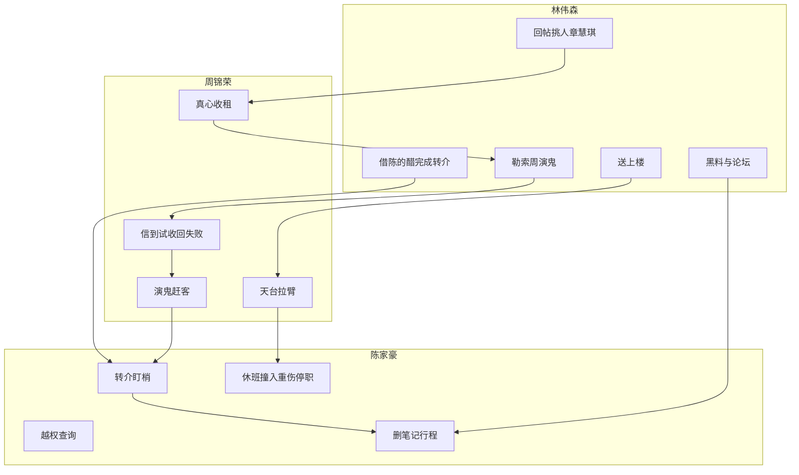

# 暗度 · 时间线与因果

对稿真相源：**何时发生、必须成立的因果**。本文件管总年表、八月日表、三条并行线、哪章可钉。周林为什么听话见 [因果与名词](06-因果与名词.md)。场次台词以各章剧本为准；人设与信息权限见 [人物志](../人物/05-人物志.md)；三层鬼释义见 [人物关系图](../人物/人物关系图.md)。

正片主轴：**2014 年 8 月**。年龄按当年。

---

## 一句话因果

林伟森要惩罚逃走的罗启明——逃走的是那个对谁都听完、听完就走的人。2014 年 6 月阿明写建议中止、当面转介。这是时限，不是已经请走：阿文笑，说下次仍来，七月预约仍收下。留不了多久。他赖着，因为阿文一走，候诊室就空，下一个女人进门他看不见，也碰不上。7 月周放盘、章慧琪发帖，三件凑齐才下手。他回帖把她送进会演戏的凶宅（周），再借陈家豪转介把她送进诊室，要阿明在天台再讲一次：系我害的。  
08-14 的信开场，与诊所笑容无关。她进诊室之后，林每周看见她门开前那一点期待的笑，又在讨论区读到「肯听完」「靠星期六」「还会去」——阿明可能留下。08-20 病程又写一次建议中止，他仍来。于是催周加快同一套吓人把戏，09-06 回「送上楼」，不能再等。  
周先真想收租；住满半个月后才被信逼成演鬼。陈以为在保护阿明，实际在拆。慧琪伸手打断重复实验。陈重伤生还、停职。周这一层可以先扣着，十二乡他仍不认。小鱼不散。真结局阿明改口；林诊室里按不住，开除并通缉。

---

## 1. 总年表（2000～片尾）

| 时 | 事 | 因果用处 |
| --- | --- | --- |
| 2000 | **罗启明、林伟森**入维港大学内外全科，五年。面试原句：「我想听人讲完。」 | 同届医科。注视从一年级就开始。对外这句话，对内是败在脑子。 |
| 2001～04 | **陈家豪**入社会学，三年，2004 毕业。三人同一书院、相邻宿舍——阿明当时已是医科二年级。林在后排记得每一次借笔记。阿明帮陈改报告：教科书都会呃人。你自己点睇。说过太闲。 | 陈把「被停下来」记成唯一；林把「对谁都听完就走」记成背叛。阿明认识林同学，不关注。 |
| 2002 冬 | 阿明考试失眠。开藤先生。打过：中学同班男生一瞬好感，后颈那种停，转瞬即逝，当时冇发生过；有时仍会停。 | **介入开始。** 当时冇发生过是真话。尺子中学已有。 |
| 2003-03 | 有盖走廊。护理见习张晓鱼发作（当日见过死亡证明，不是为谁）。阿明坐下先数四下。几天后同一走廊再遇见。林在阶梯上看见，没上前。 | 相遇。不是追求。走廊成为后来见鬼的空间。 |
| 2003 春～秋 | 附属医院过道、夜班后大学站。她问：病人定睇人。她说你睇我太耐，我会以为自己要死。值班后他说钟意。不公开。隔天她把父亲档口夹胶袋的一小块磨白鱼牌放进他掌心：叫鱼就得，这只算我哋嘅，唔好俾人睇。没有戒指。藤先生回嗯，不拆。 | 初恋。鱼牌是定情信物，不是节拍器。林听完不拆，只存档。**看人不超过三秒**从「睇太耐」来，不是 12 月「急一急」。 |
| 2003 夏 | 洗衣房。陈三个字未出口。对上了。阿明看表：约咗人。两人都记成这件事。后来转角，袋里有饭团。 | 感觉得到。不忍拆穿。躲开。林只从「请食面」知道不敢说。 |
| 2003～2004 初 | 她发作后把节拍器给他。2003-12 大学站，他因陈的报告迟到，她没有发作，只说「我想你急一急」。 | 节拍器来源。这句他十年后才听懂。 |
| 2004-06 | 大学站迟到四十分钟。林问病理、陈来电话，他都停下来听。他先数呼吸。她说「我想要你为我乱一乱」。他答「我唔想你病」。她听成把他当病人。当晚倒给藤先生：下一台＝下一个病人。 | **伪信的骨头。** 不是林拦路。和 2003-12「急一急」不是同一晚。 |
| 2004-11-01～09 | 林用三样逼 **张晓鱼（小鱼）** 自尽。11-01 信和相，11-03～04 闲话，11-05 口头暂缓值班，11-08 只问一句、当夜死，11-09 见报、即时通最后一条。不推人、不下药、不伪造病历。评语不是他写的。那一周已经这样：良景听不得「发病」；分组没有她，茶水间叫「发病嗰个」；病房不给钥匙、不让她自己签。她不是被一封信压垮。她来不及想清楚，也来不及说开。11-08 藤先生先等他恨她，他回「你吓我」。11-09 才把罪拧回他自己。他不知道有信，揽锅。仍读五年级。 | 相是并肩站过，不是发生关系。信和相没拿出来。林要他恨她，失败 → 2014 改成惩罚。过程见人物志「最后十天」、四章 4-2、4-3。 |
| 2004 | 陈取得学士学位，投考 **见习督察**。 | 两人职业分叉：医 vs 警。 |
| 2005 夏 | 罗、林医科毕业。陈去送机，走得太轻，没有追。烟从那天开始。只听到「我害了她」。阿明外地读精神科专科。林不现身。 | 封从冬天就开始。走是毕业之后。 |
| 2005～2010 | 阿明外地。定规矩：不说她的名字、看人不超过三秒。撕电话、虚焦相。节拍器扔不成，改口数呼吸工具。鱼牌也扔不成，没有临床说法，压在节拍器底下。2009 汇出即时通，密码纸条在鱼牌底下。督导问私史只说到「本科 loss」；被追问用术语墙（intrusive recall、compartmentalization adaptive）。对病人对谁都停。陈旧号空号，不留言；名单见过 Kimon Law，不敢写信。林只读公开名录。 | 术语是盾，医生身份是麻醉。罪钉在自己身上，所以看不见林。汇出档是规矩的裂缝。拿密码要先拿起鱼牌。 |
| 约 2010 | 阿明回流。陈接机提早一小时。五年当没有发生。对上超过三秒。食咗未／行李几件。澄心、钥匙、共享位置（陈告诉自己是万一：走失、跳）。 | 半秒不像旧友。下一句一定换成方便。不算谈成一段。 |
| 回流后某年 | 阿明发病上高处，陈独自抬下来。沿上冇叫名。无第三人。第二天阿明说过劳。陈备忘写过劳、私人；「条命系我捡嘅」删了。同一年精神差，一两次一夜，对方没有名字，不是陈。林从远处拍到，侧脸看不清。 | 「不能再抬你一次」。这张男人的相不进给章的信，留在林抽屉，四章才见。给章的偷拍是二〇〇三年阶梯上的罗和小鱼。睡过真。旧情人假。不要写「当药」。正片只准事实句，不写房间。 |
| 2011 | 陈娶 **陈美娟**。年夜饭仍会喝醉讲阿明。 | 美娟是「正常生活」的门；转介表面合理化。 |
| 2012-08-08 | 丽芬、周梓轩人寿加保批单。 | 加保部分可争议期至 2014-08-08。赔了。公司内部复核未结。 |
| 2012-09 | **西贡十二乡村屋**山泥倾泻。丽芬、阿轩死。人寿入账。土木署当天灾加疏忽。 | 周的把柄。罪证只在前座。索赔复核那一截没关。 |
| 2012 冬～2014 | 玩具、全家福搬到 **荣汇街 28 号** 后座。楼高六层。周住 4 楼前座。后座先是遗物仓。 | 前两周遗物不是道具；杀人证据不在租客屋里。 |
| 2013 | 林以病人 **Lam Wai-sum／阿文** 隔周贴上澄心。阿明问过「我哋系咪旧时见过」。林第三秒自己躲开，答医生见过好多人。网上化名「藤先生」。用公开名单 + 理赔部旧档案筛中周。 | 阿文是挂号显示名，就是林。当时叠不上。躲开是模仿阿明的尺子。周的盘还没挂，还没有能送进诊室的人。 |
| 2014-06 | 阿明病程第一次写「建议中止」，当面转介。阿文笑：「下次我仍来。」七月预约仍收下。不接转介。出了澄心，林备忘：第二次请走；阿文一走，就看不见下一个女人怎么望他。 | **诊所这条线开始倒计时。** 建议中止落了纸，没赶成。赖着是为了继续当阿文。人选还没出现。 |
| 2014-07-22 | 章慧琪在廿八屋讨论区发帖求助（阿琪V）。 | 人选出现。对上他已经盯着的美娟表妹。周的盘还没上，先不回。 |
| 2014-07-28 | 周自己把后座挂上 **廿八屋**（真想收租）。 | 道具屋开门。林不代放盘。 |
| 2014-07-29 | 藤先生回她的帖，附荣汇街连结。墙簿广告同期投放，只作签名。 | 蓄意指路。要她先住稳、周先收过租。 |
| 07-31 | 慧琪看见周盘。墙簿另页有「藤先生」广告，不在租盘侧栏。 | 广告是签名，不是必须点击的钩。 |
| 08-01～14 | 看房搬入；约半个月平静。修水龙头、糖水、收租。车不会自己走。 | 后面的断裂才有重量。 |
| 08-14 | 周收到红圈剪报 + 两封匿名信。下午试收回，失败。 | 演鬼成为下策，不是预谋。 |
| 08-15 凌晨起 | 周从储物室后门演鬼：拧车、旧留言、童鞋湿印。慧琪报警无用 → 找美娟 → **陈转介阿明**。美娟问过现址后，陈才越权查她凌晨那通 999。 | 转介链路：慧琪→美娟→家豪→阿明。演法见 06「周怎么装」。 |
| 08-16 | 初诊澄心。认识：住、睡、吃、她要听完。不下诊断，不上门。约下星期六带录音和记录。候诊擦肩「阿文」。当晚返屋：车已转、水已滴。美娟叫她去睡，她留下写。 | 层 3 第一次擦边。好感从这一次开始。医生叫她先别搬。 |
| 08-17 | 讨论区第一帖。藤不回。阿七留下。墙簿不发 | 不信邪。连载开始。美娟看不到 |
| 08-20 夜 | 她进厕所两分钟，湿脚印才出现。厅里看着，它不走。阿乐一句她不回。美娟的汤凉在门口。当日下午阿文在澄心，两人不遇。 | 第二周的新纸。仍不叫她的名字。 |
| 08-23 | 第二次。录音当人声。她坚持自己没问题。笔停在「离开两分钟」，下一句不说。作业：对照头两周，并有一夜不要开录音。陈在楼下等、便当。当晚她关录音，车仍走。 | 怀疑的是自己收得太快，不是整晚失忆。 |
| 08-24 上午 | 讨论区第二帖。藤只留一句：你写低。下星期再讲。阿七在追。午饭不提 | 连载。美娟看不到这版 |
| 08-24 | 美娟家吃饭。陈路过：听他写，别查房东。她不留宿。 | 亲人喂饭。不新增案情。 |
| 08-27 | 美娟电话里听见水声，叫她过去。她留下。 | 证人只听到水，听不到「阿轩」。 |
| 08-30 | 第三次。他要帮她睡、少听一次，不是帮这间屋。她崩了。他读两次那句干鞋，才说更像人。**不约上门**。要她下星期六再带纸。喜欢说漏了，越界延后。 | 冲突在前。更像人之后仍守白房边界。 |
| 08-31 上午 | 讨论区第三帖。藤又不在。阿七问下星期六。不写名、不写门牌 | 喜欢他的那句不进帖。帖里无上门日期 |
| 08-31 夜 | 车再转一次。她不打给他。周已经知道下星期六有人上来，要煮糖水。美娟在电话里只问一句。她说信约。 | 糖水接到九月六号。电话不是讨论区 |
| 09-06 16:00 | 第四次。她带多一周纸。他谂足一星期、打过督导、查过公开新闻。白房仍听不清门底，才约当晚夜访。观察，不是治疗。 | 上门合理性在这一场钉死 |
| 09-06 21:40 | 阿明上门。两人看见的鬼不是同一只。八月下旬调查没有上门。他问了年份，周才打电话；林回「送上楼」。 | 一章唯一允许的「不对齐」。 |
| 09-07 | 她来取笔记。他记得屋和水喉；人在诊所，想不出长发女人。笔记被删。黑料：二〇〇四年十一月维港大学女学生坠楼，名字涂掉；偷拍里年轻的罗和一个望住他的长发女生。她觉得自己是下一个。夜里录音叫她的名字，他回到走廊，女人又在。 | 不是整晚失忆。诊所里没有她。这栋楼的走廊里有。一章只露一个「鱼」，不给全名。 |
| 09-08 00:41 | **天台**。他先上去跟那个女人说话。周的录音才把章叫上去。周拉臂；慧琪伸手；休班陈撞入，重伤生还。 | 三线汇合。一章黑屏。 |
| 09-08 同夜 | 二章：陈楼梯倒回、读脏档案；住院、停职受查。 | 救人不洗白。 |
| 09-08～约 09-22 | 三章：正式警队推周案（陈不得经手）；女鬼不散；废弃即时通「藤先生」。 | 层 1 可结；层 2 还在；真名未拼。 |
| 之后 | 四章：大学与 2014 对上。名字靠调阅记录、签名、同一句对出来。阿明改口。诊室按不住林。开除并通缉。片尾杰仔是天台前已经寄出的下一个。 | 这一次章还站着。跳楼和十二乡定不了他。 |

---

## 1.1 小鱼最后十天（2004-11）必须成立的因果

细场以人物志和四章 4-2 为准。三样叠完她还没想清楚，也不准缩成「同一周名誉逼死」。

| 必须成立 | 不准写成 |
| --- | --- |
| 材料来自阿明即时通 + 一张真的并肩站过的相（不是发生关系） | 林打听、伪造病历、拦路害他迟到 |
| 信语气不像阿明，相是真的。她半信字、信那两秒。一周内还没断定是谁写的 | 她傻到一封匿名信就跳；她当场识破是林 |
| 见习手抖、发药差一点发错，发生在信到之后 | 评语是林写的、或无缘无故「情绪不稳」 |
| 帖不点名；打印页从门底塞进来；同房认衣服；闲话进病房。宿舍里同室会看见她。护理楼不跟她分组，茶水间叫「发病嗰个」。信和帖都写发病 | 「帖传到宿舍」没有手；闲话只是八卦；她当场全懂是林在传 |
| 良景听不得「发病」，信留在宿舍。口头暂缓之后钥匙不给、药单不让她签。带教怕发错药，没有骂她 | 家里打她；她被开除；评语是林写的；她只是太脆弱 |
| 她说冇拍拖，否认也像掩饰——因为真的没有公开 | 她是缠人的学妹 |
| 评语口头暂缓独立值班，未入永久档案；她听成读唔完、护士证拿唔到 | 林改了学校档案；她已被开除 |
| 下周一只问一句。信和相没拿出来：还没想清楚，先试最轻的；他答得太快，后半截咽回去；她说来不及下次再讲 | 傲气、疏忽、编剧藏信；她摊开信他仍揽锅 |
| 阿明以为这是又一次「黏」的争吵，不知道有信 | 阿明当晚读完信仍揽锅 |
| 她来不及完全理解，也来不及把话说开 | 只为失恋；只为取向；被推下楼；她已识破布局 |
| 新闻后藤先生两步：先等他恨她（失败）；再把他六月的「答得太快／下一个病人」还给他，把「锅不是你的」拧成「她知道是你」，并用「再查就是再把她当病人」拦住他 | 林当面说你杀了她；阿明读过信仍揽锅；他恨她 |

---

## 2. 正片日表（2014 年 8 月）

场次编号便于对剧本。未标场次的是过场／权限说明。

### 搬入前

| 日 | 事 | 章／场 |
| --- | --- | --- |
| 07-22 | 慧琪讨论区发帖求助 | 1-1 可点；4-5 |
| 07-28 | 周自挂廿八屋 | 1-1；4-5 |
| 07-29 | 藤先生回帖附连结；墙簿广告签名 | 1-1；4-5 |
| 07-31 | 慧琪看见荣汇街盘（可从帖点入，可自己搜） | 1-1 |

### 平静两周

| 日 | 事 | 章／场 |
| --- | --- | --- |
| 08-01 | 看房；定金 + 第一周周租；现金口头成交；当晚搬入 | 1-2 |
| 08-03 | 周修水龙头 | 1-3 |
| 08-07 | 周送糖水 | 1-3 |
| 08-08 | 美娟倾偈：周生好人；姐夫加班又系阿明 | 1-3 |
| 08-10 | 第二笔周租（第一笔在 08-01 连定金） | 1-3 |
| 08-12 | 车放到角落，第二天仍在 | 1-3 |
| 08-13 夜 | 水管响；录音只有水 | 1-3 |

### 变故与求诊

| 日／时 | 事 | 谁的手 | 章／场 |
| --- | --- | --- | --- |
| 08-14 信箱 | 调查剪报（红圈八月下旬）+ 匿名信两封 | 林→周 | 1-4；4-5；06 |
| 08-14 傍晚 | 周试收回自住，失败，收回这句话 | 周 | 1-4 |
| 08-15 01:03 | 开始闹：车转、脚印、录音叫阿轩 | 周演 | 1-5 |
| 08-15 凌晨后 | 999：无人伤不派车 | — | 1-5 |
| 08-15 上午 | 倾偈美娟 → 陈来电转介；地址在同一部手机。陈说精神不太好。美娟问过荣汇街再转给家豪 | 美娟／陈；（林选链路） | 1-6；2-2 |
| 08-15 上午（来电后） | 陈越权查慧琪 999／人物资料（对上凌晨 01:xx 那通） | 陈 | 2-3 |
| 08-16 16:00 | 初诊。到达时上一手客人刚出（杂志倒放）。她进门前略有期待的笑。认识：住、睡、吃、她要听完。不下诊断，不上门。约下星期六带录音和记录。林自此把周六预约挤在她四点前（隔周改每周），看见这笑 | 阿明；林擦肩 | 1-7 |
| 08-16 21:40 | 返屋：车已转、水已滴。楼梯口他已经在：白天看过水喉。不问鞋。然后美娟叫她去睡 | 周；美娟 | 1-7a |
| 08-20 下午 | 阿文再来（赖着）。阿明病程又写一次建议中止，仍收下预约，并问自己：我为什么不停他。与章的周六约错开，当晚她不在诊室 | 阿明；林 | 3-5 |
| 08-17 上午 | 讨论区第一帖。有人肯听完，未敢写名，下星期六再去。藤不回。阿七留下。不发墙簿 | 她；林读帖不回 | 1-7a帖 |
| 08-20 23:17 | 离开两分钟，湿脚印才出现。他没被叫，却说出两分钟。阿乐不回。汤凉在门口 | 周；阿乐；美娟 | 1-7a2 |
| 08-23 16:00 | 第二次。上一手仍是阿文刚走。人声，不当鬼。她坚持没问题；怨他信纸不信屋，仍靠约。他停笔。有一夜不要开录音。帖写「靠星期六」。陈楼下等、便当 | 阿明；林；陈 | 1-7b；2-3 |
| 08-23 夜 | 她关录音。车仍走。没有声音可以带去 | 周 | 1-7b2 |
| 08-24 上午 | 讨论区第二帖。「有一人肯听完。我靠星期六」。藤只留一句：你写低。下星期再讲。午后储值卡短讯催周：加快 | 她；藤；林→周 | 1-7b2；06 |
| 08-24 | 美娟家吃饭。陈：听他写，别查房东。她不留宿。午饭不提帖 | 美娟；陈 | 1-7b2 |
| 08-27 | 美娟听见水声。她留下 | 美娟；周 | 1-7b2 |
| 08-30 16:00 | 第三次。走廊再遇阿文。先要医她，她要他信屋，她崩了。干鞋读两次，更像人，**不约上门**。帖写还会去下星期六 | 阿明；林亲耳见 | 1-7c |
| 08-31 上午 | 讨论区第三帖。「有人对我好。还会去」。藤又不在。阿七问下星期六。林再短讯周：下星期六有人上嚟 | 她；林读帖；林→周 | 1-7c；06 |
| 08-31 夜 | 车再转。她不打给他。周：下星期六有人上来，我煮糖水。她说我没讲。美娟电话只问一句 | 周（林已告知）；美娟 | 1-7c |
| 09-06 16:00 | 第四次。前台：阿文刚离开。多一周纸。督导、公开新闻、观察界。约当晚夜访。林排黑料与论坛帖 | 阿明；林 | 1-7d |
| 09-06 21:40 | 上门勘察；鬼不对齐；延迟三秒 | 周层1 + 小鱼层2 | 1-8 |
| 09-06 夜 | 周打电话；林回「送上楼」。陈随后拿走现场笔记；删日历「荣汇街上门」 | 林→周；陈 | 1-8；06；2-3；3-2 |
| 09-07 14:40 | 论坛 `藤先生` 发帖（早于邮件） | 林 | 2-4 |
| 09-07 15:02 | 旺印文仪店印黑料（戴帽人） | 林 | 2-3 |
| 09-07 16:10 | 取笔记；他记得上门，诊所里想不出女人；走廊劝离；黑料进邮箱 | 陈脏 + 林黑料 | 1-9 |
| 09-07 夜 | 录音叫章慧琪；他回到走廊，女人又在；浅搜赔偿／重建 | 周升级；慧琪查 | 1-10～1-11 |
| 09-07 | 陈写「处理方案」；搜「罗启明 跳楼」 | 陈 | 2-5；2-4 |
| 09-08 00:33～ | 陈跟共享位置爬楼梯 | 陈 | 2-1；2-6 |
| 09-08 00:41 | 天台：周拉臂；阿明揽罪边缘；慧琪伸手；陈撞周重伤生还 | 三线汇合 | 1-12；2-7 |
| 09-08 后 | 陈住院、停职；周作供尚未正式拘捕 | 警队／人事 | 2-7；3-1 |

### 天台之后（章节时间）

| 时段 | 事 | 章 |
| --- | --- | --- |
| 09-08 同夜倒回 | 读陈的脏档案；美娟：「救人不等于没有害人」 | 二章 |
| 09-08 起 | 钉保单／继承／人造塌方／储值卡电话；周拘捕；层1鬼停 | 三章 3-2 |
| 约 09-12 | 回访；女鬼仍在；阿文再来。09-07 16:10 取笔记时他不在诊室 | 3-4 |
| 三章中后 | 咨询名单 阿文／Lam Wai-sum；废弃即时通「藤先生」 | 3-5；3-6 |
| 周案之后 | 维修令对上赔案调阅记录，带出林伟森。挂号单后半截签名对上员工证。即时通和阿文亲口是同一句。诊室里按不住他。公司开除，通缉恐吓和盗用档案。跳楼和十二乡定不了。杰仔的转介在天台前已寄出 | 四章 4-6～4-8 |

---

## 3. 三条并行线（谁在干什么）

| 线 | 表面动机 | 实际效果 | 二章后玩家应分清 |
| --- | --- | --- | --- |
| **周** | 调查前清后座、保保险窗口 | 把慧琪赶上楼，给林要的同框 | 演鬼、匿名信执行者；不是黑料作者 |
| **陈** | 保护阿明、拆开「危险女人」 | 把慧琪送进诊室又拆；差点做成小鱼 | 越权、删证、恐吓草稿是他的；黑料不是 |
| **林** | 病人／回帖／上门 | 排场；要阿明再说「系我害的」 | 伪信、周、讨论区回帖、黑料、`藤先生`、便签／链路 |

---

## 4. 因果链（必须成立的因果）

### 4.1 为什么慧琪会进诊室

1. 她分手后在讨论区发帖；藤先生回帖附荣汇街连结（可不读帖，列表里仍只有这一条能住）。墙簿广告是签名，不是钩。  
2. 周真心便宜租、口头无印花 → 她住得进、走不掉。  
3. 住满约半个月后林才寄信 → 周收回失败 → 演鬼。  
4. 999 不派车 → 找表姐 → 姐夫大学识的医生朋友 → 转介丝滑。  
5. 林早核对「美娟表妹」自然链路；**不进医院排班本**。  
6. 动手的导火索是 6 月建议中止落纸、他赖着不走（诊所这条线只够用这个夏天），不是暗恋满十年，也不是「六月已被踢走」。见 [因果与名词](06-因果与名词.md)「建议中止落了纸，他赖着不走」。

### 4.2 为什么 09-07 他在诊所想不出那个女人

按顺序，不要跳。

1. **09-06 夜里，女人在她家里的走廊。** 他看见长发，不是房东太太。他记得这一晚：车、水龙头、延迟三秒、周说的年份、叫她不要上天台。不是整晚消失，不是落药。
2. **09-07 下午，人在诊所。** 诊所是白房间，不是那条走廊。事实还在：车、水喉、三秒。长发女人的画面跟不回白房——场景一变，侵入的影像就出不来。所以他说：失忆是整晚没有，我有。这是旧伤，不是鬼上身。你不要帮我补。
3. **笔记被拿走，他核对自己。** 陈删的是 09-06「荣汇街上门」，拿走的是现场本。本子里有没有写下「长发女人」，他查不到。这让「我写过没有」悬空，不是让「我去过没有」悬空。陈以为他会把整晚忘掉。他没有。
4. **09-07 夜里他回到那栋楼。** 录音叫了章慧琪的名字。他一进同一条走廊，长发女人又站在尽头。诊所里没有她。这栋楼的这条走廊里有她。
5. **他走上天台，是去跟这个女人说话。** 话是：系我害的。我同你一齐。你唔好再站在走廊。他以为跟她走到上面，她就不会继续站在下面等。不是因为忘了前一天——他记得车、水喉、三秒，也记得叫她不要上天台；是白房想不起她，走廊里她又出现。上楼前他亲口对章说：我上去同佢讲，你留喺下面，唔好跟。章锁门在楼下。周的录音和灯灭才把章叫上去。
6. **不是**：下药、改正式病历、医院同层权限、第二天不认得这个病人、突然决定寻死、拉章一起跳。沿上一只鞋在沿外，是回流第一年身体往高处走的旧病再发，话是对空气讲的，不是对章慧琪。

### 4.3 为什么阿明会在天台上

不是黑料一到，人就冲上楼。三步分开。

1. **四个星期六，09-06 他才上门。** 第三次只说更像人，他拖足一星期才约夜访：督导、观察界、公开新闻都写在第四次。录音里女人叫人吃饭，他看见走廊尽头长发，不是全家福里的丽芬。章靠四个星期六撑过来，上门时说高兴是他来。他看见的女人太像当年。他自己的规矩——回流第一年接近一个长发女病人，人已经走到沿上，陈抬下来过——再靠近这种女人，身体会往高处走。当晚他叫章不要上天台，然后自己先走。
2. **黑料打在旧闻和偷拍。** 09-07 下午纸进的是她的邮箱：二〇〇四年十一月，维港大学，女学生坠楼。新闻写男友罗某自称有责任。名字涂掉。另一张是偷拍：年轻的罗，一个长发女生望住他。信说你而家望住罗医生，同相里一样。下一个就系你。名字涂不干净，露出一个「鱼」。不写全名张晓鱼，不写过程，不写跟谁睡过，不写「当药」，也不写谁逼她跳。女人死了。他自己说：十一月是她坠下去的那个月；我信了十年，是我害了鱼。章这一个月把高兴放在他身上，看见相里那个位置就是自己，觉得自己就是下一个，开始警惕。他怕的是她不再望他，一松就又有人跌。所以他说「你信我，先至危险。松开都得。你先安全。」
3. **他自己先上天台。** 09-07 夜里回到走廊，长发女人又在。他对章讲明：记得昨夜，不是失忆；要上去同那个女人讲，章留下面、锁门、不要跟。09-08 零点他已经在女儿墙上，对空气说：系我害的。我同你一齐。你唔好再站在走廊。说话对象不是章。身体却先走到沿上——回流第一年发生过一次。周的录音「上天台」和全屋灯灭才把章叫到同一层。章到了，他认人要两秒，叫她不要跟、他脏。陈是跟着共享位置来的。林不在楼上推他。林在楼下。细步见上面 4.2。
4. 慧琪伸手拉住他 → 再讲一次「系我害的」被打断。陈撞周，重伤。

### 4.4 为什么三章周能抓、林抓不到

1. 周供出信与电话；维修令复印件、储物室道具、天台行为够扣。  
2. 林用储值卡、戴帽打印、无指纹；结构上断线。  
3. 陈停职 + 利益冲突 → **不得经手**周案；阿明／慧琪整理可交付证据给正式警队。

### 4.5 为什么四章才拼出真名

| 碎片 | 最早出现 | 单独不够 |
| --- | --- | --- |
| 藤先生 | 一章墙簿；二章论坛；三章即时通 | 网上化名。不出现在候诊叫号 |
| 阿文／Lam Wai-sum | 一章候诊；三章名单 | 诊所挂号显示名 + 英文登记。阿文就是林伟森。和「藤先生」对不上字 |
| 理赔部 W.S. Lam／人事底表 | 四章工作台 | 与诊所英文登记并排，才证实中文全名林伟森 |

### 4.6 为什么林不对陈家豪下手

1. 陈要留着。他可以站得很近，又永远不讲出口。那个只属于一个人的位子还空着，这一次才有空位。  
2. 杀了陈，阿明看见血就会看见人。看见人，这一次结不成；阿明还可能看见林伟森。  
3. 陈会拆、会跑楼梯、会把命捡回去。拆得笨，仍是林的手。所以留着。  
4. 不准写成：林雇凶、下药、对陈动手。不沾血包括不对陈动手。

---

## 5. 哪章可钉（三层鬼）

三层鬼是什么见 [人物关系图](../人物/人物关系图.md) §5。停板全文见各章剧本文首。本表只管时机：

| 层 | 哪章可钉 |
| --- | --- |
| 1 周在演 | 三章周供／搜查 |
| 2 小鱼 | 三章仍在；四章改口后空 |
| 3 林排场 | 四章 |

信息权限见 [人物志](../人物/05-人物志.md) 各人节。

---

## 6. 刻意不用的旧因果

以下已废，对稿勿写回：

- 陈与阿明同房／同专业／医院同层同事  
- 陈改病历、偷药下药、诊所闭路员工权限  
- 林往医院排班本塞便签作为唯一转介机关  
- 墙簿按年龄性别投放作为唯一选人机关  
- 林代放盘、改周的标题、或买通 999／美娟  
- 「暗恋十年所以这个夏天动手」作为唯一动机  
- 陈死在天台／殓房  
- 「口头租客会分走重建款」「空置更不利收购」「一搜十二乡就坐实谋杀」
- 林对陈家豪动手、雇凶、下药
- 把成人向场面写进正片对白、界面或 Flag（钟点房、酒店、浴室、录像、身体过程）。正片「睡过／一夜」只作事实句

现行香港政策对照仍见 [06-因果与名词](06-因果与名词.md) 名词表。
